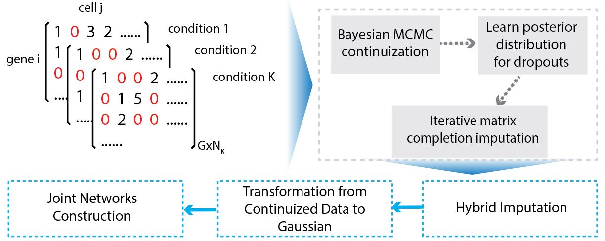

# *Joint Gene Network Construction by Single Cell RNA Sequencing Data under Multiple Conditions*

```{r, include = FALSE}
knitr::opts_chunk$set(
  collapse = TRUE,
  comment = "#>"
)
```

Overview of JGNsc framework: <br />
{width=90%}


## Installation
```{r setup, eval=F}
if (!require("devtools")) {
  install.packages("devtools")
}
devtools::install_github("meichendong/JGNsc")

library(JGNsc)
```

## Example -- Simulation

The following code simulates raw count data from more than one conditions. 
```{r, eval=F}
set.seed(1)

# example: the first 20 genes have different structure, the rest of genes have the same structures.
scenario = "DI20" # can change this to DD/DI100/ID
nsample = 200

if (scenario == "DD"){
  nivec.list.diff <- list(nivec= c(10,20,30,40, rep(20,5)),nivec2 = rep(20,10))
  diffblk = list( 1:4,1:5)
  sigma.list.1 <- generateSigmaList(nivec.list = nivec.list.diff, structure = "Diff S, Diff W", diffblk = diffblk)
} else if (scenario =="DI20"){
  nivec.list.diff <- list(nivec= c(rep(2,10), rep(20,9)),nivec2 = rep(20,10))
  diffblk = list( 1:10,1)
  sigma.list.1 <- generateSigmaList(nivec.list = nivec.list.diff, structure = "Diff S, Identical W", diffblk = diffblk)
} else if (scenario =="DI100"){
  nivec.list.diff <- list(nivec= c(10,20,30,40, rep(20,5)),nivec2 = rep(20,10))
  diffblk = list( 1:4,1:5)
  sigma.list.1 <- generateSigmaList(nivec.list = nivec.list.diff, structure = "Diff S, Identical W", diffblk = diffblk)
} else if (scenario =="ID"){
  nivec.list <- list(nivec= rep(20,10),nivec2 = rep(20,10))
  sigma.list.1 <- generateSigmaList(nivec.list = nivec.list, structure = "Identical S, Diff W", diffblk = NULL)
}
# Create a list of count matrices
countlist.1 <- getCountList(sigma.list = sigma.list.1, nvec = rep(nsample,2), a3=2.5, b3=1)
```

The network structure (simulation truth) is available at `countlist.1` above. Check the details by
```{r, eval=F}
str(countlist.1)
observed.list <- list(t(countlist.1[[1]]$data), t(countlist.1[[2]]$data))
```

Run JGNsc imputation and continuization step, and the Joint Graphical Lasso (JGL) model with AIC as tuning parameter selection criterion.
```{r, eval=F}
simulation.result <- JGNsc(observed.list = observed.list, min.cell = 10, runNetwork = T)
```


## Example -- MB data
The data is from the [paper Hovestadt et al.](https://www.nature.com/articles/s41586-019-1434-6).  
The data is preprocessed by [Seurat](https://satijalab.org/seurat/).  
The processed example data is available at xxxxx.  
```{r, eval=F}
# Seurat object
sobj <- readRDS("H0102_seuratobj_3d.rds")  
# metabolism enzyme only pathway
meta2 <- read.csv("Mammalian_Metabolic_enzyme_genes.csv")
```

Check demographic information by groups:
```{r, eval=F}
getGENEbox(countmat = sobj@assays$RNA@counts, group = sobj$group3, gene = "MYC")
getGENEhist(countmat = sobj@assays$RNA@counts, group = sobj$group3, gene = "MYC")
```

Create a list of raw count matrices:
```{r, eval=F}
MB.3cond <- getObservedList(mtx = as.matrix(sobj@assays$RNA@counts), group = sobj$group3, geneSet = c(toupper(meta2$GeneSymbol), "MYC", "OTX2"))
```

Run JGNsc imputation and continuization step. The current version may take hours or longer if the data dimension is high. Faster algorithm is in development.
```{r, eval=F}
MB.3cond.continuous <- JGNsc(observed.list = MB.3cond, min.cell = 10, runNetwork = F)
```

Tuning parameter selection by AIC, for JGL model:
```{r, eval=F}
res <- getJGLTuningParamResult(GauList = MB.3cond.continuous$theta.star.npn)
# transform the precision matrix to partial correlation
partcorr <- lapply(res$jgl.res, prec2partialcorr)
```

### Gene Set Enrichment analysis
```{r, eval=F}
test <- Map2Pathways(partcorr.list = partcorr,
                     conditions = c("Group 4","Group 3","Intermediate"),
                     GeneInterest = "MYC",
                     pathwayRef = meta2,
                     pathwayRef_geneVariable = "GeneSymbol",
                     pathwayRef_pathVariable = "SigmaMiniMap.Term",
                     threshold =0)
GSEA.table <- test$GSEA.table
```

### Visualize joint networks
```{r, eval=F}
gconnect = c(toupper(test$cond.connect[[3]]$GeneSymbol), gene1)
highlight = gconnect %in% c(gene1)
net1 = plot_onenet(partcorr[[1]][gconnect,gconnect], gname = "Group 4", circlenet = T, nodecolor = c("orange","lightblue")[highlight+1], family.vec = highlight)
gconnect = c(toupper(test$cond.connect[[1]]$GeneSymbol), gene1)
highlight = gconnect %in% c(gene1)
net2 = plot_onenet(partcorr[[2]][gconnect,gconnect], gname = "Group 3", circlenet = T, nodecolor = c("orange","lightblue")[highlight+1], family.vec = highlight)
gconnect = c(toupper(test$cond.connect[[2]]$GeneSymbol), gene1)
highlight = gconnect %in% c(gene1)
net3 = plot_onenet(partcorr[[3]][gconnect,gconnect], gname = "Intermediate", circlenet = T, nodecolor = c("orange","lightblue")[highlight+1], family.vec = highlight)
library(cowplot)
plot_grid(net2, net3, net1, ncol = 3)
```


## Example -- GBM data
The data is from the [paper Neftel et al.](https://www.sciencedirect.com/science/article/pii/S0092867419306877?via%3Dihub).
The processed example data is available at xxxxx.  
```{r, eval=F}
sobj <- readRDS("N0102_seuratobj_3d_malignant_adult.rds")   
```

To be added...

